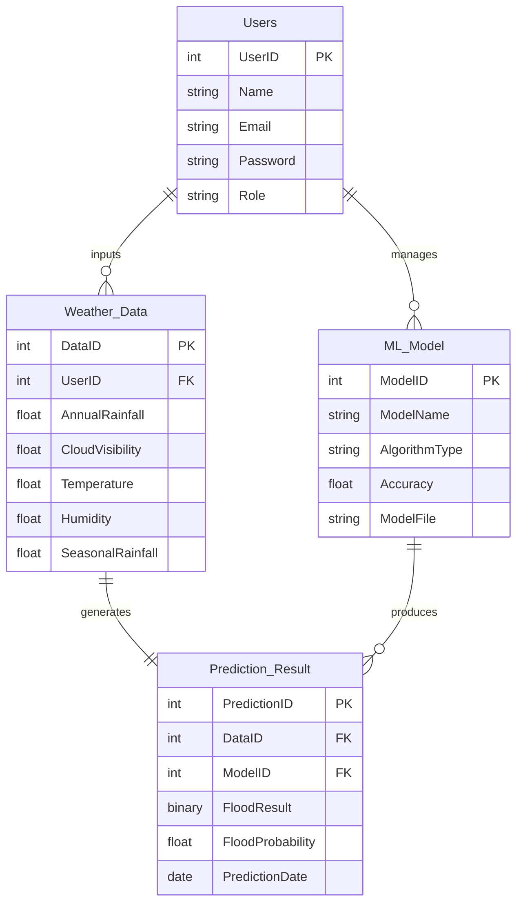
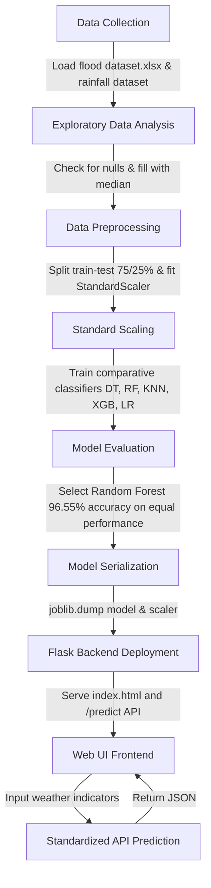

# FloodSense AI 🌊
An intelligent flood risk prediction and meteorological analysis system powered by machine learning and Flask.

---

## 🛠️ Pre-requisites

To run the machine learning pipeline, explore the Jupyter notebook, and host the web application, you require the following dependencies:

### 1. Software & Environment
* **Python**: `3.9+` (Recommended `3.10` or `3.11`)
* **Jupyter Lab / Jupyter Notebook**: For running and reviewing `notebook.ipynb`

### 2. Python Packages
Install the required packages using the package manager `pip`:

```bash
pip install pandas numpy scikit-learn xgboost openpyxl joblib Flask requests matplotlib seaborn
```

### 3. Folder Directory Structure
Ensure your workspace matches the following layout:
```text
FloodSense-AI/
├── data/
│   ├── flood dataset.xlsx               # Primary model training dataset
│   └── rainfall in india 1901-2015.xlsx # Historical rainfall analysis dataset
├── models/
│   ├── flood_model.joblib               # Serialized Random Forest model
│   └── scaler.joblib                    # Serialized StandardScaler
├── static/
│   ├── style.css                        # Premium dark-mode glassmorphic styling
│   ├── script.js                        # Frontend API fetch and animation logic
│   └── (visualizations: heatmap, bar charts, etc.)
├── templates/
│   └── index.html                       # Application HTML template
├── train.py                             # Machine learning model training script
├── app.py                               # Flask web server
└── notebook.ipynb                       # Jupyter notebook for EDA and model exploration
```

---

## 📊 Entity Relationship Diagram & Data Schema

Although the project operates on local spreadsheets rather than a SQL database, the data exhibits logical schemas and associations that drive predictions.

### 1. Data Schema Definitions

#### Weather Dataset (`flood dataset.xlsx`)
This dataset contains meteorological readings representing microclimate features for specific subdivisions and historical flood occurrences.
* **Temp** (Float): Average local temperature in degrees Celsius.
* **Humidity** (Float): Relative atmospheric humidity in percentage (%).
* **Cloud Cover** (Float): Cloud cover percentage (%).
* **ANNUAL** (Float): Annual cumulative rainfall in millimeters (mm).
* **Jan-Feb / Mar-May / Jun-Sep / Oct-Dec** (Float): Seasonal rainfall totals in millimeters (mm).
* **avgjune** (Float): Average rainfall during June in millimeters (mm).
* **sub** (Float): Sub-division water basin runoff indicator index.
* **flood** (Binary Target): Occurrence of flood event (0 = No Flood, 1 = Flood).

#### Rainfall Dataset (`rainfall in india 1901-2015.xlsx`)
This dataset maps historical climate trends over more than a century across subdivisions in India.
* **COUNTRY** (String): Country name (e.g., India).
* **STATE** (String): Indian state/sub-division.
* **YEAR** (Integer): Year of observation.
* **JAN through DEC** (Float): Monthly rainfall averages in millimeters (mm).
* **ANNUAL / Jan-Feb / Mar-May / Jun-Sep / Oct-Dec** (Float): Aggregated seasonal rainfall in millimeters (mm).

### 2. Schema Relationship Diagram
The diagram below illustrates how the features from both datasets feed into the prediction models and application layer:



---

## 🔄 Project Flow

The system operates in a sequential pipeline where data is processed, trained, and served to the user:



### Step-by-Step Flow Details
1. **Data Collection**: Reads Excel sheets (`flood dataset.xlsx` and `rainfall in india 1901-2015.xlsx`) containing subdivisions' rainfall records and atmospheric inputs.
2. **EDA & Visualizations**: The Jupyter notebook analyzes average rainfall distributions, generates subdivision heatmaps, and reviews the target balance of the flood classes.
3. **Data Pre-processing**:
   - Resolves any missing values by replacing them with the column median.
   - Splits features (`X`) and targets (`y`) using a stratified train-test split (`test_size=0.25`, `random_state=93`) to maintain balanced labels.
   - Normalizes feature inputs via `StandardScaler` to bring variables like temperature and annual rainfall into uniform scaling boundaries.
4. **Model Building & Evaluation**:
   - Compares Logistic Regression, Decision Tree, Random Forest, K-Nearest Neighbors, and XGBoost.
   - Saves the **Random Forest** model which achieves **96.55%** test accuracy and delivers smooth, continuous probability estimates.
5. **Application Integration**:
   - Flask server loads `flood_model.joblib` and `scaler.joblib` on startup.
   - Web application listens for JSON inputs from the dashboard, processes features, scales them, executes prediction, and returns the response back to the client interface.
